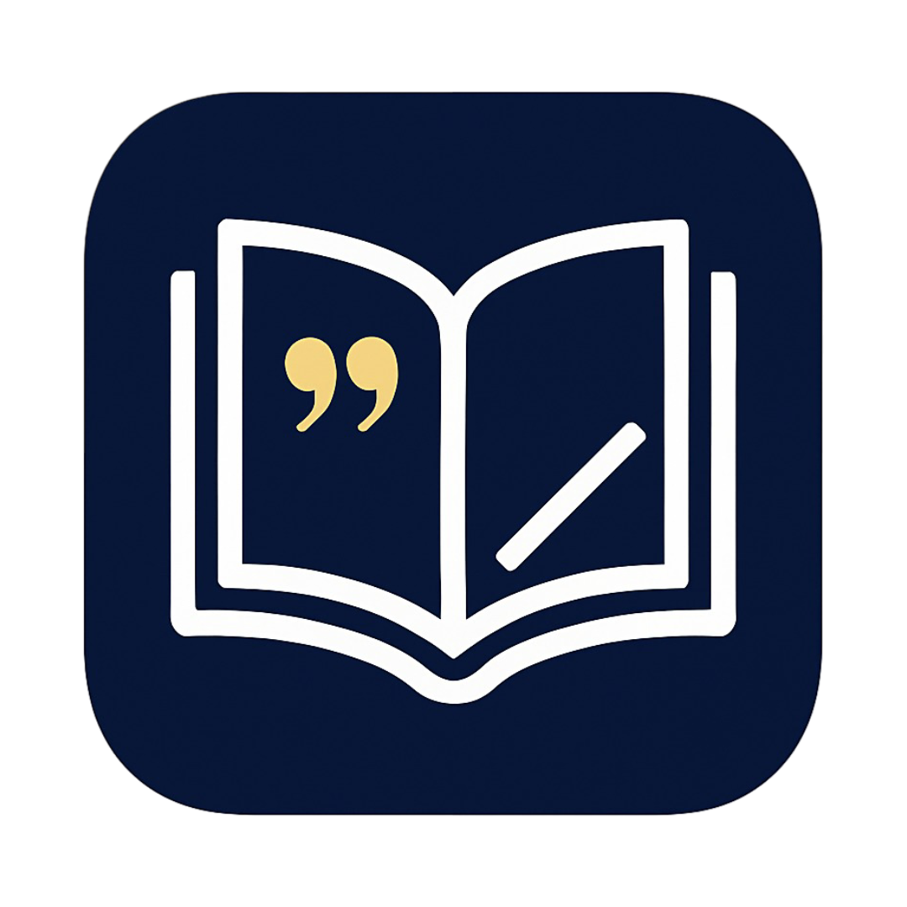
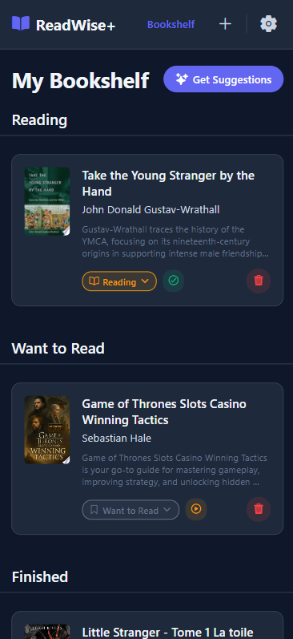
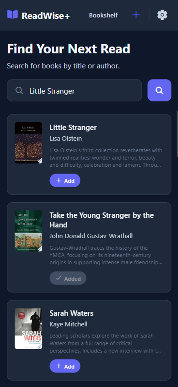
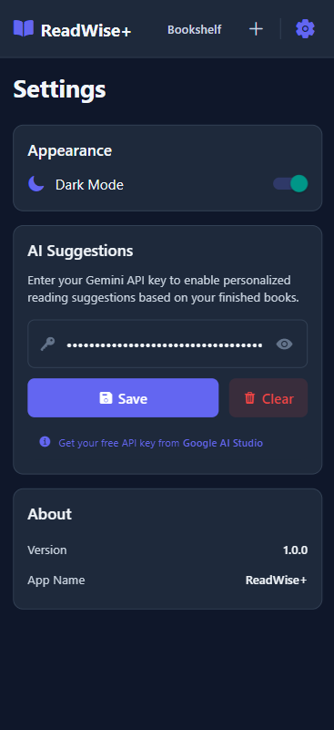

<div align="center">
  
  
  # ReadWise+ 📚
  
  **Your Personal Reading Companion**
  
  A beautiful, feature-rich mobile app for tracking your reading journey, collecting memorable quotes, and discovering your next great read with AI-powered suggestions.
  
  [](https://reactnative.dev/)
  [](https://expo.dev/)
  [](https://www.typescriptlang.org/)
  [](LICENSE)
  
</div>

---

## 📱 Screenshots

<div align="center">
  
</div>

<div align="center">
  
  
  
</div>

---

## ✨ Features

### 📚 **Smart Book Management**
- **Search & Discover**: Find books instantly using Google Books API
- **Organized Shelves**: Categorize books into "Want to Read", "Reading", and "Finished"
- **Quick Actions**: Move books between shelves with intuitive gestures
- **Rich Details**: View book covers, descriptions, authors, and page counts

### 💭 **Quote Collection**
- **Save Memorable Quotes**: Capture your favorite passages with timestamps
- **Tag System**: Organize quotes with custom tags for easy retrieval
- **Beautiful Display**: Elegant quote cards with proper formatting

### 🤖 **AI-Powered Suggestions**
- **Personalized Recommendations**: Get book suggestions based on your reading history
- **Visual Previews**: See book covers and compelling reasons for each recommendation
- **Smart Integration**: Seamlessly add suggested books to your library

### 🎨 **Beautiful Design**
- **Dark & Light Themes**: Switch between themes based on your preference
- **Responsive Layout**: Optimized for all screen sizes
- **Smooth Animations**: Delightful interactions and transitions
- **Custom Icons**: Beautiful, consistent iconography throughout

### 🔒 **Privacy & Security**
- **Offline-First**: All data stored locally on your device
- **No Account Required**: Start using immediately without sign-up
- **Secure API Storage**: Your API keys are encrypted and stored locally
- **Complete Control**: Export, backup, or delete your data anytime

---

## 🚀 Quick Start

### For Users (APK Installation)

1. **Download the APK** from our [latest release](https://expo.dev/accounts/sato_san/projects/readwise-plus)
2. **Enable Unknown Sources** in your Android settings
3. **Install the app** and open ReadWise+
4. **Configure Settings**:
   - Tap the ⚙️ settings icon
   - Add your [Gemini API key](https://aistudio.google.com/app/apikey) for AI suggestions
   - Choose your preferred theme
5. **Start Reading!** Search for books and build your personal library

### For Developers

#### Prerequisites
- Node.js (v16 or higher)
- Expo CLI: `npm install -g @expo/cli`
- Android Studio (for Android development)
- Xcode (for iOS development, macOS only)

#### Installation

```bash
# Clone the repository
git clone https://github.com/SallahBoussettah/readwise-mobile.git
cd readwise-mobile

# Install dependencies
npm install

# Start the development server
npm start
```

#### Development Scripts

```bash
npm start          # Start Expo development server
npm run android    # Run on Android device/emulator
npm run ios        # Run on iOS device/simulator (macOS only)
npm run web        # Run in web browser
```

---

## 🏗️ Architecture

### Project Structure
```
ReadWiseMobile/
├── 📱 components/              # React Native UI components
│   ├── Header.tsx             # Navigation header
│   ├── BookCard.tsx           # Book display component
│   ├── BookshelfView.tsx      # Main library view
│   ├── AddBookView.tsx        # Book search interface
│   ├── BookDetailView.tsx     # Individual book details
│   ├── SettingsView.tsx       # App configuration
│   ├── QuoteCard.tsx          # Quote display component
│   ├── ShelfSelector.tsx      # Shelf management
│   └── SuggestionsModal.tsx   # AI recommendations
├── 🔧 services/               # Business logic & APIs
│   ├── googleBooksService.ts  # Google Books API integration
│   ├── geminiService.ts       # AI suggestions service
│   └── storageService.ts      # Local data persistence
├── 🎨 assets/                 # Images, icons, screenshots
├── 📝 types.ts                # TypeScript definitions
├── 🎨 theme.ts                # Design system & themes
└── 📱 App.tsx                 # Main application component
```

### Tech Stack

| Category | Technology | Purpose |
|----------|------------|---------|
| **Framework** | React Native + Expo | Cross-platform mobile development |
| **Language** | TypeScript | Type-safe development |
| **Storage** | AsyncStorage | Local data persistence |
| **APIs** | Google Books API | Book search and metadata |
| **AI** | Google Gemini | Reading recommendations |
| **Icons** | Expo Vector Icons | Consistent iconography |
| **Build** | EAS Build | Production app compilation |

---

## 🔧 Configuration

### API Setup

#### Google Books API
- ✅ **No setup required** - Uses public endpoints
- ✅ **Rate limits** - Generous free tier
- ✅ **Rich metadata** - Covers, descriptions, ratings

#### Gemini AI API
1. Visit [Google AI Studio](https://aistudio.google.com/app/apikey)
2. Create a new API key
3. Open ReadWise+ → Settings → AI Suggestions
4. Paste your API key and save

### Environment Variables (Development)
```bash
# Copy example file
cp .env.example .env

# Add your API key
GEMINI_API_KEY=your_api_key_here
```

---

## 📦 Building & Distribution

### Android APK
```bash
# Build preview APK (for testing)
npx eas build --platform android --profile preview

# Build production APK
npx eas build --platform android --profile production
```

### iOS IPA (Requires Apple Developer Account)
```bash
# Build for iOS
npx eas build --platform ios --profile preview
```

### Build Profiles (eas.json)
```json
{
  "build": {
    "preview": {
      "distribution": "internal",
      "android": { "buildType": "apk" }
    },
    "production": {
      "android": { "buildType": "apk" }
    }
  }
}
```

---

## 🤝 Contributing

We welcome contributions! Here's how to get started:

### Development Workflow
1. **Fork** the repository
2. **Create** a feature branch: `git checkout -b feature/amazing-feature`
3. **Make** your changes with proper TypeScript types
4. **Test** on both iOS and Android
5. **Commit** with clear messages: `git commit -m 'Add amazing feature'`
6. **Push** to your branch: `git push origin feature/amazing-feature`
7. **Submit** a Pull Request

### Code Style
- Use **TypeScript** for all new code
- Follow **React Native** best practices
- Maintain **consistent formatting** with Prettier
- Add **proper error handling**
- Include **component documentation**

### Testing
- Test on **multiple devices** and screen sizes
- Verify **dark/light theme** compatibility
- Check **offline functionality**
- Validate **API error handling**

---

## 📄 License

This project is licensed under the **MIT License** - see the [LICENSE](LICENSE) file for details.

---

## 🙏 Acknowledgments

- **Google Books API** for comprehensive book data
- **Google Gemini AI** for intelligent recommendations
- **Expo Team** for excellent development tools
- **React Native Community** for continuous innovation
- **Open Source Contributors** who make projects like this possible

---

## 📞 Support

- 🐛 **Bug Reports**: [Open an issue](https://github.com/SallahBoussettah/readwise-mobile/issues)
- 💡 **Feature Requests**: [Start a discussion](https://github.com/SallahBoussettah/readwise-mobile/discussions)
- 📧 **Contact**: [boussettah.dev@gmail.com](mailto:boussettah.dev@gmail.com)

---

<div align="center">
  
  **Made with ❤️ for book lovers everywhere**
  
</div>